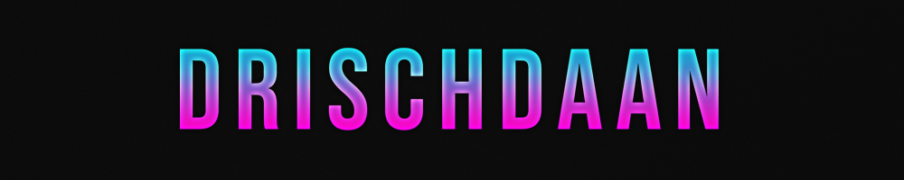
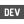

    

<h2 align="center">Hi </h2>

    

        Nice to see you here! My name is Tristan (aka. Drischdaan). I am from germany and currently I am working at a company that develops <a href="https://en.wikipedia.org/wiki/Enterprise_resource_planning">erp</a> software. In my free time I like to develop my own projects, play games with friends or just hang out with them.
    

     
    

        I am very interested in how computers / the operating system works and in general in game development. In the past I worked on several cheat-, website- and on home automation projects. Currently I am focusing on game engine development and home automation.
    

     
    

        
        
        
    

 

## Support

    

